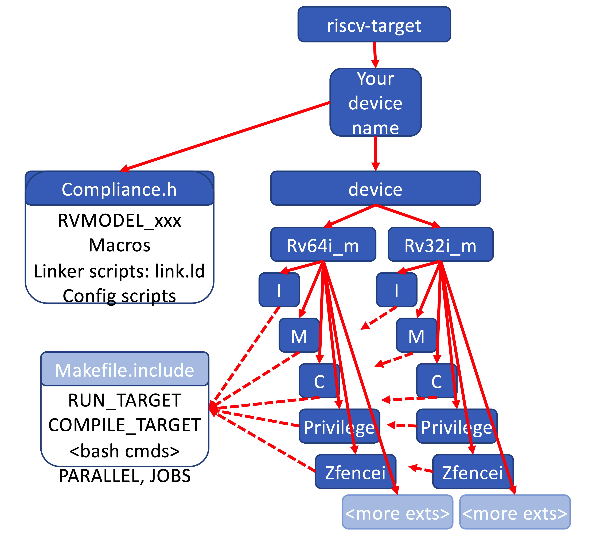

= RISC-V Architectural Testing Framework =
RISC-V Foundation Architecture Test SIG
Issue 1.16 Draft
:toc:
:icons: font
:numbered:
:source-highlighter: rouge

////
SPDX-License-Identifier: CC-BY-4.0

Document conventions:
- one line per paragraph (don't fill lines - this makes changes clearer)
- Wikipedia heading conventions (First word only capitalized)
- US spelling throughout.
- Run "make spell" before committing changes.
- Build the HTML and commit it with any changed source.
- Do not commit the PDF!
////

== Introduction
=== About

This document describes the RISC-V Architectural Testing framework which is used to test if a RISC-V device's has understood and implemented the specifications correctly

* It explains the framework around the tests, the running of individual tests, and the suites of tests.

* It explains how to set up targets to run the tests.

This document is made freely available under a <<app_cc_by_4.0>>.

=== Intent of the architectural test suite

The RISC-V Architectural Tests are an evolving set of tests that are created to help ensure that software written for a given RISC-V Profile/Specification will run on all implementations that comply with that profile.

These tests also help ensure that the implementer has both understood and implemented the specification correctly.

The RISC-V Architectural Test suite is a minimal filter. Passing the tests and having the results approved by RISC-V International is a prerequisite to licensing the RISC-V trademarks in connection with the design. Passing the RISC-V Architectural Tests does not mean that the design complies with the RISC-V Architecture. These are only a basic set of tests checking important aspects of the specification without focusing on details.

The RISC-V Architectural Tests are not a substitute for rigorous design verification.

The result that the architecture tests provide to the user is an assurance that the specification has been interpreted correctly and the implementation under test (DUT) can be declared as RISC-V Architecture Test compliant.

=== Intended audience

This document is intended for design and verification engineers who wish to check if their RISC-V implementation (simulation models, HDL models, etc.) is compliant to the RISC-V specification. 

For those who wish to develop new architectural tests and/or to write or adapt their own test framework are suggested to read the link:../spec/TestFormatSpec.adoc[`Test Format Spec`].


=== Contribute

You are encouraged to contribute to this repository (including changes to this document) by submitting pull requests and by commenting on pull requests submitted by other people as described in the link:../README.md[`README.md`] file in the top level directory.

While submitting a pull request note that some directories use `ChangeLog` files to track changes in the code and documentation.  Please honor these, keeping them up to date and including the ChangeLog entry in the _git_ commit message.

Make sure to also include a comment with the SPDX license identifier in all source files, for example:
```
// SPDX-License-Identifier: BSD-3-Clause
```

NOTE: Don't forget to add your own name to the list of contributors in the document.

== Licensing

In general:

* code is licensed under the BSD 3-clause license (SPDX license identifier `BSD-3-Clause`);
* documentation is licensed under the Creative Commons Attribution 4.0 International license (SPDX license identifier `CC-BY-4.0`).

The files link:../COPYING.BSD[`COPYING.BSD`] and link:../COPYING.CC[`COPYING.CC`] in the top level directory contain the complete text of these licenses.

NOTE: The riscv-ovpsim simulator is licensed under an Imperas license. There is no dependency on this and it is included as a convenience to users.


==== AsciiDoc

This is a structured text format used by this document.  Simple usage should be fairly self evident.

* Comprehensive information on the format is on the http://www.methods.co.nz/asciidoc/[AsciiDoc website].

* Comprehensive information on the tooling on the https://asciidoctor.org/[AsciiDoctor website].

* You may find this https://asciidoctor.org/docs/asciidoc-syntax-quick-reference/[cheat sheet] helpful.

==== Installing tools

To generate the documentation as HTML you need _asciidoctor_ and to generate as
PDF you need _asciidoctor-pdf_.

* These are the https://asciidoctor.org/docs/install-toolchain/[installation instructions for asciidoctor].

* These are the https://asciidoctor.org/docs/asciidoctor-pdf/#install-the-published-gem[installation instructions for asciidoctor-pdf].

To spell check you need _aspell_ installed.

==== Building the documentation

To build HTML:
[source,make]
----
make html
----

To build PDF:
[source,make]
----
make pdf
----

To build both:
[source,make]
----
make
----

To check the spelling (excludes any listing or code phrases):
[source,make]
----
make spell
----

Any custom words for spell checking should be added to link:./custom.wordlist[`custom.wordlist`].

=== Contributors

This document has been created by the following people (in alphabetical order of surname).

* Jeremy Bennett
* Mary Bennett
* Simon Davidmann
* Neel Gala
* Radek Hajek
* Lee Moore
* Milan Nostersky
* Marcela Zachariasova

=== Document history
[cols="<1,<2,<3,<4",options="header,pagewidth",]
|================================================================================
| _Revision_ | _Date_            | _Author_ | _Modification_
| 1.16 Draft | 23 September 2020 | Neel Gala| Changed Compliance to Architecture/Architectural. Refined the steps to port a new target. Removed simulator and target specific docs. Added vocabulary from the Test Format Specification
| 1.15 Draft | 14 March 2019     |
Prashanth Mundkur |

Added support and instructions for using the C and OCaml simulators from the Sail RISC-V formal model as targets.
| 1.14 Draft  | 21 February 2019      |
Deborah Soung |

Documented how to use SiFive's RISC-V ISA Formal Specification model as a target.
| 1.13 Draft  | 29 January 2019      |
Deborah Soung |

Added documentation on how to use Rocket Chip generated cores as targets.
| 1.12 Draft  | 22 November 2018      |
Simon Davidmann |

Updated notes on Test Suites.
| 1.11 Draft  | 21 November 2018      |
Neel Gala |

Added new signature format specs .
| 1.10 Draft  | 20 June 2018      |

Simon Davidmann, Lee Moore |

Cleaned up description of updated framework and inclusion of riscvOVPsim.

| 1.9 Draft  | 12 June 2018      |

Jeremy Bennett |

Update Future work section to take account of Codasip changes. Remove diagrammatic directory structure.

| 1.8 Draft  | 12 June 2018      |

Jeremy Bennett |

Add Future work section.

| 1.7 Draft  | 12 June 2018      |

Jeremy Bennett |

Add CC license as an appendix.

| 1.6 Draft  | 10 June 2018      |

Jeremy Bennett |

Tidy up areas that are flawed in HTML version.

| 1.5 Draft  |  8 June 2018      |

Jeremy Bennett |

General tidy up.

| 1.4 Draft  |  8 June 2018      |

Jeremy Bennett |

Added license preamble.

| 1.3 Draft  |  5 June 2018      |

Simon Davidmann |

Updated to reflect directory structure and trace macros.

| 1.2 Draft  |  3 June 2018      |

Jeremy Bennett |

Converted to AsciiDoc, cleaned up and restructured.

| 1.1 Draft  |  1 June 2018      |

Simon Davidmann
Lee Moore |

Revised format and expand to describe framework, usage of many tests groups,
and different Targets

|1.0         | 24 December 2017  |

Radek Hajek
Milan Nostersky
Marcela Zachariasova |

First version of the document.

|================================================================================

== Repository structure

The top level directory contains :

 - a `README.md` file providing high-level details about the RISC-V Architecture Testing Framework. 
 - top level `Makefile` for running the tests on a RISC-V implementation.
 - `ChangeLog` for logging changes with respect to code.
 -  complete license files for the Creative Commons and BSD licenses used by the task group.  

There are then five top level directories.

`doc`:: All the documentation for the project, written using _AsciiDoc_.

`coverage`:: This directory contains a sub-directory structure similar to the `riscv-test-suite` directory. The coverage reports of each test-suite are available in the corresponding directories. The reports are available in the html and yaml formats. The directory also contains multiple coverpoint YAMLs which capture all the coverpoints of interest which are covered by all the tests in the `riscv-test-suite` directory.

`riscv-target`:: Contains a further subdirectory for each target, within which are placed the `model_test.h` header for that target and a `device` directory for all the devices of that target. If the `$TARGETDIR` environment variable is set to another directory, the scripts will search this directory for targets instead.

`riscv-test-env`:: This contains the `verify.sh` script which checks if the signatures generated the riscv-target device match the statically hosted reference signatures at the end of simulation. The directory also contains symbolic-links to the `arch_test.h` and `encoding.h` files present in the `riscv-test-suite/env` directory.

`riscv-test-suite`:: This contains a further `env` subdirectory which contains the `arch_test.h` and the `encoding.h` file which includes common assembly macros and routines which is used across the tests in the suite. Further directories are present which contain the actual architectural tests. The names and structure of these directories is based on the link:../test-pool structure guideline highlighted above. 

`riscv-ovpsim`:: This contains a README pointing to the Imperas OVP riscvOVPsim simulator for use in architectural testing. 

== Vocabulary
=== The architectural test

At the heart of the testing infrastructure is the detailed <<The architectural tests, _architectural test_>> available as `.S` assembly files. The specification and format of the tests is defined in the link:./TestFormatSpec.adoc[`Test Format Specification`].

=== The architectural test pool

The <<The architectural test, _architectural tests_>> are grouped into different functional test suites targeting the different subsets of the RISC-V specification. For more details on the test-pool structure, hierarchy and conventions please refer to the link:./TestFormatSpec.adoc[`Test Format Specification`].

For information on the currently supported different test suites, look here: link:../riscv-test-suite/README.md[../riscv-test-suite/README.md]

=== The test signature

Each test in the <<The architectural test pool, _architectural test pool_>> generates a <<The test signature, _test signature_>>, which represents the data written into specific memory locations during the execution of the test. The signature typically will record values (or sanitised values) of the operations carried out in the test. More details on the format and nature of the signatures is available in the link:./TestFormatSpec.adoc[`Test Format Specification`]

=== The reference signature

In order to claim that a device/implementation has passed the RISC-V Architecture Tests, the <<The test signature, _test signatures_>> obtained from the execution of the tests on the implementation need to be compared against a set of _golden_ <<The reference signatures, _reference signature_>>. These reference signatures are currently generated by the link:https://github.com/rems-project/sail-riscv[`RISC-V SAIL`] formal model and statically hosted in the repository for each test.

=== The test target
The <<The test target,_test target_>> can be either a RISC-V Instruction Set Simulator (ISS), a RISC-V emulator, a RISC-V RTL model running on an HDL simulator, a RISC-V FPGA implementation or a physical chip. Each of the target types offers specific features and represents specific interface challenges. It is a role of the  <<The target shell, _target shell_>> to handle different targets while using the same <<The architectural test pool,_architectural test pool_>> as a test source.

=== The target shell
The <<The target shell, _target shell_>> is the software and hardware environment around the <<The test target,_test target_>> that enables it to communicate with the framework, including assembling and linking tests, loading tests into memory, executing tests, and extracting the signature. The input to the <<The target shell, _target shell_>> is a .S <<The architectural test,_architectural test_>> file, and the output is a <<The test signature,_test signature_>>.


== Porting a new target


In this section, a short tutorial on how to add a user target to the RISC-V Architectural Test Framework is provided.

The following steps demonstrate an example in which a target was replaced by the RISCV-ISA-SIM 
(a.k.a Spike). In a similar way, any RISC-V ISA simulator or any RTL simulation model of the 
RISC-V processor can be ported as a potential target for testing.

=== Setup environment variables

NOTE: `ROOTDIR` will always point to the riscv-arch-test repo.

1. Clone the repository: 

  ---
  git clone https://github.com/riscv/riscv-arch-test.git
  cd riscv-arch-test

  ---

2. Open the `Makefile.include` available in the root folder of the repository and edit the following
variables based on your target:
   
 a. `TARGETDIR` : set `TARGETDIR` to point to the directory which contains a sub-folder in the same name
 as the target. For example, the arch-test repo includes the targets: sail-riscv-c and spike
 under the `riscv-target` folder, in which case we set the `TARGETDIR` to riscv-target as shown
 below. One can set this completely arbitrary paths as suitable by the user.
 
 
   ---
   export TARGETDIR ?= $(ROOTDIR)/riscv-target
   
   ---

 b. `XLEN`: set XLEN to max supported XLEN. Allowed values are 32 and 64.

   ---
   export XLEN 							?= 64

   ---

c. `RISCV_TARGET`: set this variable to the name of the target. A folder of the same name must exist in 
the `TARGETDIR` directory

  ---
  export RISCV_TARGET       ?= spike

  ---

d. `RISCV_DEVICE`: set the `RISCV_DEVICE` environment to the extension you want to compile, simulate and verify. Leave
this blank if you want to iterate through all the supported extensions of the target. Allowed values
are the individual names of the extensions supported by your target like: I, M, C or Zifencei, etc. Multiple extensions are not be provided.

  ---
  export RISCV_DEVICE       ?= 

  ---

e. `RISCV_TARGET_FLAGS`: set this to a string which needs to be passed to your target's Makefile.include files

  ---
  export RISCV_TARGET_FLAGS ?= 

  ---

f. `RISCV_ASSERT`: set this if you want to enable assertions on the test-suites. **Currently no tests use assertions.**
  
  ---
  export RISCV_ASSERT       ?= 0

  ---

g. `JOBS`: set the number of parallel jobs (along with any other arguments) you would like to
execute. Note that the target needs to  be coded in such a way to support parallel execution. Some
targets use common intermediate files, rather than unique files, which makes them unsuitable for 
parallel execution, these targets will need to be re-coded.
  
  ---
  JOBS= -j1

  ---

3. Now inside your `TARGETDIR/RISCV_TARGET` directory you will need to create the following files:

a. `model_test.h`: A header file containing the definition of the various target specific
assembly macros that are required to compile and simulate the tests. The list and definition of the 
required target specific macros is available in the link:../spec/TestFormatSpec.adoc[Test Format
Specification]

b. `link.ld`: A linker script to compile the tests for your target.

c. Any other files required by the target (configuration scripts, logs, etc.) can also be placed in
this directory.

4. Inside the `TARGETDIR/RISCV_TARGET` directory create a new folder named: `device`. If your device
is a 32-bit target then create a directory `device/rv32i_m`. If your device is a 64-bit target then
create a directory `device/rv64i_m`. If your target is configurable on the `XLEN` parameter then
both the folders need to be created. 

5. Within the `rv32i_m`/`rv64i_m` directories sub-folders in the name of the extensions supported
by the target need to be created. For eg. A target supporting the ISA RV32IMC_Zifence will have the
following directory structure:
   
   ---
   - rv32i_m/I
   - rv32i_m/M
   - rv32i_m/C
   - rv32i_m/privilege
   - rv32i_m/Zifencei

   ---

6. Each of the above extension directories will now need to include a file: `Makefile.include` which
defines the following Makefile variables:

a. `RUN_TARGET`:: This variable needs to include commands and steps to execute an ELF on target device. Note here that this variable should include all the necessary steps and arguments to run that specific test-suite. For example, in case of spike for the `rv32i_m/C` test-suite the corresponding `Makefile.include` has the `--isa=rv32ic` argument as opposed to just `--isa=rv32i` for the base `rv32i_m/I` test-suite. This variable should also include other steps to extract and sanitize the signature file as well for each test. The only argument available to this variable is the compiled `elf` file.

b. `COMPILE_TARGET`:: This variable should include the commands and steps required to compile an assembly test for the target for each extension mentioned above. Note, currently only the GCC compiler is supported. This compiler takes `march` and `mabi` arguments from the corresponding architectural suite framework. `COMPILE_TARGET` will more or less be the same across test-suites. The only argument available to `COMPILE_TARGET` is the assembly file of one architectural test.

The following figure depicts the final directory structure of a target device that should get created at the end of the above steps:

[#img-testStruct]
.File Structure of the Target directory



=== Generating Signature

As previously mentioned the execution of each test on the target must generate a signature file. The name of the signature file should be `<test-file-name.signature_output>`. The signature file should follow the guidelines mentioned in the link:../spec/TestFormatSpec.adoc[`Test Format Specification`].

In case of spike, we have ensured that the signature region is bounded by the labels: `begin_signature` and `end_signature`. This is enforced in the `RVMODEL_DATA_BEGIN` and `RVMODEL_DATA_END` macros defined in the `riscv-target/spike/model_test.h` file. Additionally, if you look closely at the `RUN_TARGET` variable defined in the `Makefile.include` files of the spike target, it includes a few bash commands to sanitize the signature produced from spike. This is done to conform the final signature file to the specification defined in the link:../spec/TestFormatSpec.adoc[`Test Format Specification`].

=== Compile, simulate and verify the tests

Once you have ported your target to the riscv-arch-test framework by following the above steps, you
are now ready to compile, simulate and verify the tests on your target

If you would like to compile, simulate and verify all the extension tests applicable to your target
simply run `make` from the `ROOTDIR`. 

NOTE: For the above to work the `RISCV_DEVICE` in  `ROOTDIR/Makefile.include` must be left empty. 

If you would like to only compile the tests for a particular extension you can use the following
command. 

  make RISCV_DEVICE=M compile
  make RISCV_DEVICE=C compile

The arguments to the `RISCV_DEVICE` variable must be the extensions supported by the target. 
NOTE: If `RISCV_DEVICE` is not defined/empty it will default to the `I` extension which is necessary
for all targets.

To simulate the compiled tests on your target:

  make RISCV_DEVICE=M simulate
  make RISCV_DEVICE=Zifencei simulate

NOTE: If `RISCV_DEVICE` is not defined/empty it will default to the `I` extension which is necessary
for all targets.

To verify if the generated signatures match the corresponding reference signatures.

  make RISCV_DEVICE=M verify 

NOTE: If `RISCV_DEVICE` is not defined/empty it will default to the `I` extension which is necessary
for all targets.

All the above steps create and modify files in the `work` directory created in `ROOTDIR` folder. To
clean the `workdir` simple run :

  make clean

By default the working directory is set to `ROOTDIR/work`. This can be overwritten by assigning a
new working directory path via the command line. Note, the path must be absolute and not relative :

  make WORK=/home/me/my_path/mywork clean compile simulate
