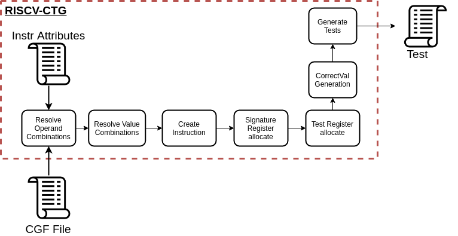

.. See LICENSE.incore for details

########
Overview
########

RISCV-CTG is the RISC-V based Compatibility Test Generator. This tool is used to generate tests used in
the official `RISC-V Architectural Test Suite <https://github.com/riscv/riscv-compliance>`_ and
the RISC-V architectural test framework `RISCOF <https://riscof.readthedocs.io>`_. All tests generated by 
the CTG are compliant with the official `Test Format Spec <https://riscof.readthedocs.io/en/latest/testformat.html>`_.

The CTG is similar to a constrained test generator capable of generating tests targeting a specific
set of constraints. These constraints are supplied to the CTG using the `Coverage Group Format
<https://riscv-isac.readthedocs.io/en/latest/cgf.html>`_ (CGF) File. The CGF file contains various
cover-points for different instructions. The CTG treats each cover-point as a constraint and employs a
solver to identify potential solutions. CTG uses the constraint satisfaction problem (CSPs) solvers
offered by the `python-constraint <https://pypi.org/project/python-constraint/>`_ package.

Target Audience
===============

The target users/audience of the CTG would be verification and design engineers who would like to
create a suite of tests focusing on covering specific corner cases. These tests could then be used
as way of demonstrating the capabilities of the instruction itself.

Note, that the capabilities of the CTG is completely limited by the limitations of the cover-points
in the CGF. A more elaborate CGF covering all corner cases of an instruction can be supplied to CTG
to create a near verification test for that instruction.

CTG Components and Flow
=======================

The following diagram shows the internal flow of data of the CTG. The following sections will
discuss briefly about the working of the CTG.

.. _attributes:

Instr Attributes
----------------

In order to generate tests for a given instructions attributes of the instruction need to be known
before hand. This information is stored within the CTG in a YAML format known as the `attributes file
<https://github.com/riscv/riscv-ctg/riscv_ctg/data/template.yaml>`_.

Each node in the attributes files has the following structure:

.. code-block:: yaml

  name:                         # name of the instruction
    xlen:                       # list of XLEN values under which this instruction is applicable
    isa:                        # RISC-V ISA extension this instruction attribute belongs to
    operation:                  # a python evaluated string which defines the function of the instruction
    formattype:                 # a string indicating the format type of the instruction
    rs1_op_data:                # a list of legal registers that can be used as operand 1
    rs2_op_data:                # a list of legal registers that can be used as operand 2
    rd_op_data:                 # a list of legal registers that can be used as destination
    rs1_val_data:               # a list of integers that can be used as values for operand 1
    rs2_val_data:               # a list of integers that can be used as values for operand 2
    template:                   # a string indicating the assembly macro to be used to creating tests.

Following is an example of the "add" instruction attribute

.. code-block:: yaml

  add:
    xlen: [32,64]
    isa: I
    operation: 'hex((rs1_val + rs2_val) & (2**(xlen)-1))'
    formattype: 'rformat'
    rs1_op_data: *all_regs
    rs2_op_data: *all_regs
    rd_op_data: *all_regs
    rs1_val_data: 'gen_sign_dataset(xlen) + gen_sp_dataset(xlen,True)'
    rs2_val_data: 'gen_sign_dataset(xlen) + gen_sp_dataset(xlen,True)'
    template: |
  
      // $comment
      // opcode: $inst ; op1:$rs1; op2:$rs2; dest:$rd; op1val:$rs1_val;  op2val:$rs2_val
      TEST_RR_OP($inst, $rd, $rs1, $rs2, $correctval, $rs1_val, $rs2_val, $swreg, $offset, $testreg)
  

Note in the above example `gen_sign_dataset(**)` and `gen_sp_dataset(**)` are custom functions 
defined within the CTG to generate the relevant data points required for those fields.

.. note:: \*all_reg is an alias to a node defined in the attributes yaml prior to the add node.

.. _opval_comb:

Op and Val Combinations
-----------------------

The first two stages of the CTG receive the input CGF file and identify solutions for the
operands and value combinations. These solutions are carried out independent of each other. During
these phases solvers are employed to find solutions which satisfy the corresponding cover-points.
Immediate values are also assigned here.

If randomization is enabled, then random solvers are employed.

Instruction Creation
--------------------

In this stage, the operand and value combination solutions derived in the previous phases are combined with
each other in this phase to complete all the fields of the instruction under test.

Signature and Test Register Allocation
---------------------------------------

Each instance of the instruction should also be provided a signature register to save the result of
the operation and an additional test register to perform alternate target-specific checks or debug.

The registers are allocated in a greedy fashion, such that maximum number of instructions use the
same signature and test registers. This thus leads to minimal transfer of pointers across registers.

CorrectVal Generation
---------------------

.. warning:: This feature is a WIP and is not completely supported yet.

For a few arithmetic instructions like add, sll, sub, etc the corresponding operation field in the
:ref:`attributes <attributes>` YAML can be easily defined to capture the behavior of those
instructions. In this, phase CTG uses those fields to define the expected values/result of those
operations. These correctval fields in the tests can be used to perform inline checking of results
and debug failures.

Generate Tests
--------------

Finally, with all the fields defined, specific templates of the tests which conform to the Test
Format Spec are used to generate the assembly files for each instruction.

Parallel Runs
-------------

Since CTG employs CSP solvers the runtime of certain constraints involving large data sets can soon
shoot up. Also typically CTG is used to generate a suite of test across instructions instead of a
single test. Thus to reduce runtime in suite generations, CTG internally allocates a cover-group in
the CGF to an individual host-process thereby parallelizing the runs.

Why Random Solvers?
===================

The random solvers are essential in boosting speed. With loosely defined constraints in the CGF,
(like ``rs1_val >0 and rs2_val>0``) the solvers may spend quite some time to find all the solutions
when the datasets are large. Random solvers on the other hand provide the first solution that
satisfies the problem and quit after that, thereby saving time.

A second benefit of using random values for loosely defined constraints, is that it increases the
chances of covering multiple cover-points (that may be presented later) in the same instruction. This
thereby reduces the number of instructions required to cover all the cover-points mentioned in the
cover-group of the CGF.

One must note that at no point is the coverage of the test compromised due to the use of random
solvers. 

A obvious down-side of using random solvers is the fact that the same test cannot be reproduced
again. However, the typical intent of users of CTG would be to generates tests satisfying the
cover-points defined in the CGF. Since that is guaranteed by CTG, the reproducibility issue can be
set aside.
