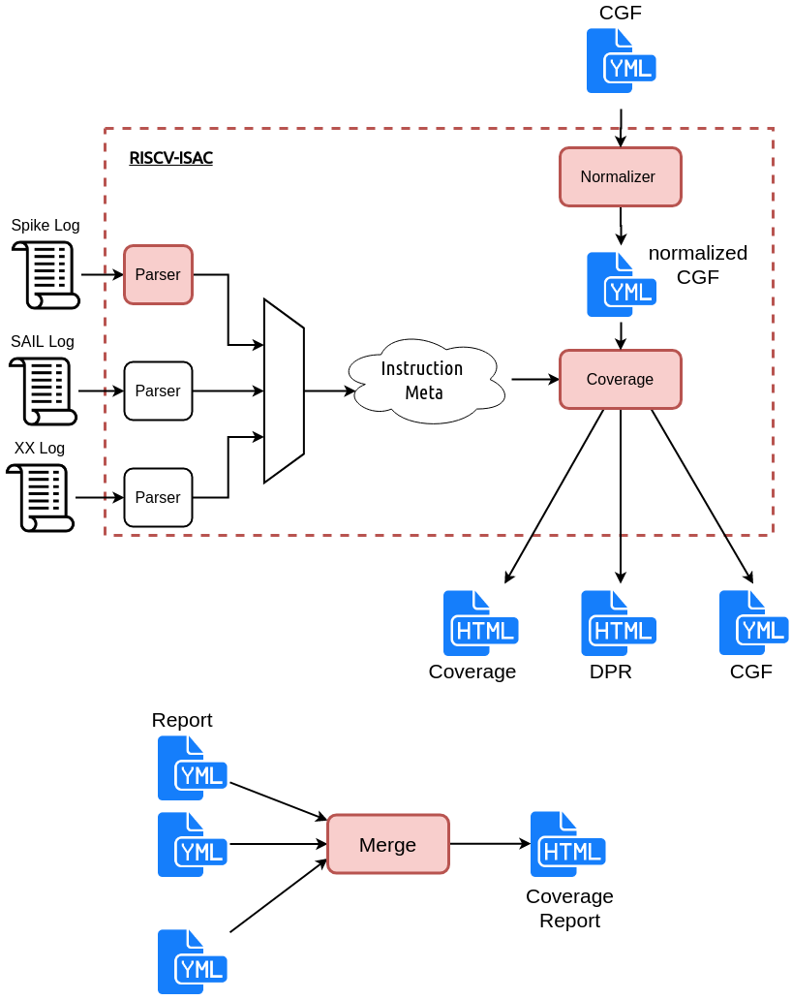

.. See LICENSE.incore for details

########
Overview
########

RISC-V ISAC is an ISA coverage extraction tool. Given a set of coverpoints and an execution trace of
a test/application run on a model, ISAC can provide a report indicating in detail which of those
coverpoints were covered by the test/application. ISAC also holds the capability to provide a
detailed quality analysis on data propagation occurring within the test/application. 
The figure below shows the overall flow of RISCV-ISAC.

.. _fig-isac:

RISCV-ISAC is primarily split into 2 major parts: the front-end parser and the backedn coverage
analyser. This split enables RISCV-ISAC to support parsing of multiple different execution log
formats and provide the same level of coverage and QA support.

The following sections will provide details on the working and flow of both these modules.

Cover Group Format
==================

The coverpoints of interest are captured in an intuitive YAML format. This YAML structure is called
Cover Group Format. A CGF File typically consists of a single dataset node and multiple covergroups.
Each covergroups can define multiple coverpoints for differen set of instructions. Currently only
cross-products of operand registers and operand values is supported. More details on CGF can be
found in :ref:`cgf`.

.. _exec_trace:

Execution Trace Format
======================

RISCV-ISAC requires an execution trace of the test/application run on the RISC-V target (ISS or RTL)
as an input. RISCV-ISAC uses this trace to analyse the coverpoints covered. The execution trace to 
be used or supported in RISCV-ISAC needs to meet the following criteria: 

- Every instruction that was committed/executed by the model (can be ISS or RTL) should be captured
  as an entry in the log in the order which they were committed.
- Each instruction entry must include the program counter pointing to the begining of that
  intruction
- Each instruction entry must include the hex encoding of the instruction that was
  committed/executed. 
- Each instruction entry must also include any architectural state update occuring due to the
  execution of that instruction. For eg, the destination register that was updated, the csr that was
  modified, mem regions that were written to, etc.
- Each instruction entry can span multiple lines
- Information of each instruction must be retrievable via regular-expression.
- Mnemonics of the instruction is possible, should be provided as well.

.. _parser:

Parser-Module
=============

The parser-module is designed to parse an execution trace to extract information on a per instruction
commit basis. Given an execution trace adhering to the above format, the parser-module is capable of deducing and
extracting the information to into a common instruction class object. This object is then passed onto the coverage-module for
coverpoint analysis.

With the parser-module being decoupled from the coverage-module, support for parsing different execution
trace formats can be easily integrated into RISCV-ISAC.

Currently the execution traces from the following RISC-V Models is support

- SAIL: Generate a trace using the ``-v`` flag
- SPIKE: Generate a trace using ``--log-commits`` flag

.. See :ref:`add_parser` to know how to add your custom trace support to RISCV-ISAC.

.. _normalizer:

Normalizer-Module
=================

The coverpoints defined in the input CGF file may contain abstract functions like ``walking_ones``,
``walking_zeros``, etc. which provide ease to the user in defining large datasets. 
The normalizer module is responsible for unrolling these abstract functions to individual
coverpoints and generate a normalized CGF file which is used by the coverage-module.

.. _cov_module:

Coverage Module
===============

The coverage-module is responsible for carrying out the coverage analysis and generating a YAML and
HTML reports on the same. The coverage-module maintains a simple architectural state of RISC-V like
PC, integer registerfile , etc. This state is updated based on the instructions encountered in the
execution trace. 

Each time an instruction class object is presented by the parser, the coverage-module checks the
normalized CGF file is any of the coverpoints were hit by that particular instruction. A single
instruction can hit multiple coverpoints. 

The coverage-module also allows restricting the coverage to a specific region(s) of the test. These
regions are specified by the user based on the labels available in the test. The coverage-module
uses these labels and elf to deduce the exact address ranges. 

The coverage-module can be further restricted to collect coverage only on certain covergroups
specified in the CGF file via the ``--cov-label (-l)`` argument. 

The coverage-module can also provided a data-propagation report which captures how coverpoints are
the instructions contributing to them are being stored in a the memory region. This is particularly
helpful when creating signature based tests. This feature however requires specifying labels of
memory regions similar to how test-regions are specified using the ``--sig-label`` argument.

The coverage-module at the end of execution generates 4 artifacts. 

  - The first is an updated CGF file with frequencies added to each coverpoint. This file is useful
    when merging multiple coverpoints across different runs.
  - A YAML based report capturing the detailed and high-level coverpoint ratios.
  - An HTML based report capturing the same information as the YAML
  - A data propagation report in Markdown format. This is available only when signature/data regions
    are specified as an argument.

Details on adding support for new instructions in ISAC is covered in :ref:`add_instr`.

Merge Module
============

RISCV-ISAC also provides a simple merge-module which can merge multiple CGF reports to create a
single report. This is useful for creating a coverage report for an entire suite of tests.
