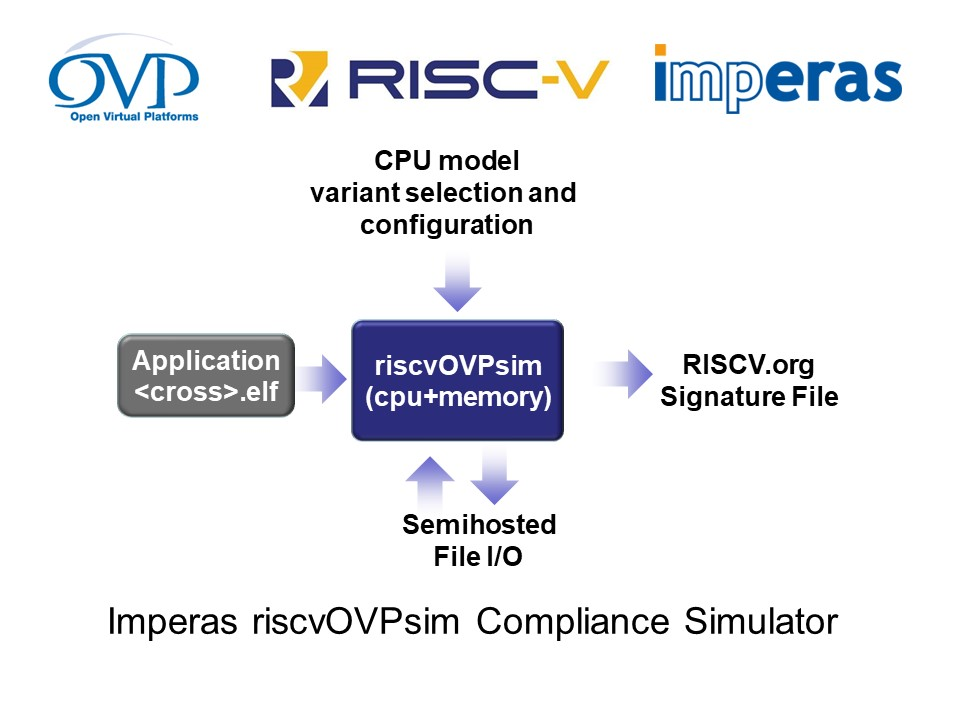

riscvOVPsim
===
A Complete, Fully Functional, Configurable RISC-V Simulator
===

Author: Imperas Software, Ltd., using OVP Open Standard APIs  
Date   : 31 Jan 2019 
Version: 20190131.0  
License: Model source included under Apache 2.0 open source license  
License: Simulator riscvOVPsim licensed under Open Virtual Platforms (OVP) Fixed Platform Kits license  
RISC-V Specifications currently supported:
- RISCV.org User 2.2, 2.3a (April 2018 draft)  
- RISCV.org Privilege 1.10, 1.11a (April 2018 draft)[not hypervisors as currently in flux]

About riscvOVPsim
---
The **riscvOVPsim** simulator implements the full and complete functionality of the RISC-V Foundation's public User and Privilege specifications.  

The simulator is command line configurable to enable/disable all current optional and processor specific options. 

The simulator is developed, licensed and maintained by [Imperas Software](http://www.imperas.com/riscv) and it is fully compliant to the OVP open standard APIs. 

As a member of the RISC-V Foundation community of software and hardware innovators collaboratively driving RISC-V adoption, Imperas has developed the riscvOVPsim simulator to assist RISC-V adopters to become compliant to the RISC-V specifications. The latest RISC-V compliance test suite and framework can be downloaded from https://www.github.com/riscv/riscv-compliance . 

riscvOVPsim includes an industrial quality model and simulator of RISC-V processors for use for compliance and test development. It has been developed for personal, academic, or commercial use, and the model is provided as open source under the Apache 2.0 license. The simulator is provided under the under Open Virtual Platforms (OVP) Fixed Platform Kits license that enables download and usage. riscvOVPsim and Imperas RISC-V support is actively maintained and enhanced. To ensure you make use of the current version of riscvOVPsim this initial release will expire. Please download the latest version.

Runtime configurable settings for all RISC-V specification options makes it very easy to compare run time results with any RTL implementations.

Full commercial features including variant selection, comprehensive trace, GDB/Eclipse graphical source code debug, semihosting, and RISC-V foundation signature dump facility for compliance testing.

More information: [riscvOVPsim user guide](doc/riscvOVPsim_User_Guide.pdf)  
Model Source: [source](source)  
Examples: [examples](examples)  

  
riscvOVPsim is a fixed function simulation of one configurable processor model in a fixed platform. Full extendable platform simulations of reference designs booting FreeRTOS, Linux, SMP Linux etc. are available as open source and are available from [www.IMPERAS.com](http://www.imperas.com), [www.OVPworld.org](http://www.OVPworld.org).  

Debugging using GDB / Eclipse
---
The same fixed platform can be used to debug the application using GDB and Eclipse.

For GDB debug add the command line argument _-gdbconsole_, this will start the GDB debugger and connect to the virtual platform.

For Eclipse debug, using CDT, a configuration to attach to an external remote application for debug should be made. The port to attach to is opened on the running virtual platform by adding the command line argument _-port <port number>_ when starting the virtual platform. 

Please see the [riscvOVPsim user guide](doc/riscvOVPsim_User_Guide.pdf) for full details.

Using riscvOVPsim
---
To use the simulator, just download the files, go into one of the example directories, and execute the provided run scripts.
For example on Linux:  

> $ cd examples  
> $ cd fibonacci  
> $ RUN_RV32_fibonacci.sh  
> 
> CpuManagerFixedPlatform (64-Bit) 20180425.0 Open Virtual Platform simulator from [www.IMPERAS.com](http://www.imperas.com).  
> Copyright (c) 2005-2018 Imperas Software Ltd.  Contains Imperas Proprietary Information.  
> Licensed Software, All Rights Reserved.  
> Visit [www.IMPERAS.com](http://www.imperas.com) for multicore debug, verification and analysis solutions.  
>   
> CpuManagerFixedPlatform started: Tue Apr 24 19:12:06 2018  
>   
> Info (OR_OF) Target 'riscvOVPsim/cpu' has object file read from 'fibonacci.RISCV32-O0-g.elf'  
> Info (OR_PH) Program Headers:  
> Info (OR_PH) Type           Offset     VirtAddr   PhysAddr   FileSiz    MemSiz     Flags Align  
> Info (OR_PD) LOAD           0x00000000 0x00010000 0x00010000 0x00016998 0x00016998 R-E   1000  
> Info (OR_PD) LOAD           0x00017000 0x00027000 0x00027000 0x000009c0 0x00000a54 RW-   1000  
> starting fib(38)...  
> fib(0) = 0  
> fib(1) = 1  
> fib(2) = 1  
> fib(3) = 2  
> ...  
> fib(36) = 14930352  
> fib(37) = 24157817  
> finishing...  
> Info   
> Info ---------------------------------------------------  
> Info CPU 'riscvOVPsim/cpu' STATISTICS  
> Info   Type                  : riscv (RV32IMAC)  
> Info   Nominal MIPS          : 100  
> Info   Final program counter : 0x100ac  
> Info   Simulated instructions: 4,400,537,204  
> Info   Simulated MIPS        : 1439.2  
> Info ---------------------------------------------------  
> Info   
> Info ---------------------------------------------------  
> Info SIMULATION TIME STATISTICS  
> Info   Simulated time        : 44.01 seconds  
> Info   User time             : 3.06 seconds  
> Info   System time           : 0.00 seconds  
> Info   Elapsed time          : 3.10 seconds  
> Info   Real time ratio       : 14.18x faster  
> Info ---------------------------------------------------  
>   
> CpuManagerFixedPlatform finished: Tue Apr 24 19:12:10 2018  
>   
> CpuManagerFixedPlatform (64-Bit) 20180425.0 Open Virtual Platform simulator from [www.IMPERAS.com](http://www.imperas.com).  
> Visit [www.IMPERAS.com](http://www.imperas.com) for multicore debug, verification and analysis solutions.  
  
Extending riscvOVPsim and building your own models and platforms
---
riscvOVPsim is a fixed function simulation of one configurable processor model in a fixed platform. Full extendable platform simulations of reference designs booting FreeRTOS, Linux, SMP Linux etc. are available as open source and are available from [www.IMPERAS.com](http://www.imperas.com), [www.OVPworld.org](http://www.OVPworld.org).  

About Open Virtual Platforms (OVP) and Imperas Software
---
**Open Virtual Platforms** was created in 2008 to provide an open standard set of APIs and methodology to develop virtual platforms and simulation technology. 
[www.OVPworld.org](http://www.OVPworld.org/riscv).

**Imperas Software Ltd.** is the leading independent commercial developer of virtual platforms and high-performance software simulation solutions for embedded processor and systems. Leading semiconductor and embedded software companies use Imperas simulators for their processor based simulation solutions.
[www.imperas.com](http://www.imperas.com/riscv).

  
  
---

This is the riscvOVPsim/README.md  
