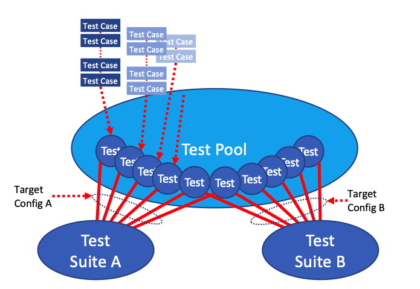

= RISC-V Compliance Test Format Specification =
RISC-V Foundation Compliance Task Group
Issue 1.0 Draft
:toc:
:icons: font
:numbered:
:source-highlighter: rouge

////
SPDX-License-Identifier: CC-BY-4.0

Document conventions:
- one line per paragraph (don't fill lines - this makes changes clearer)
- Wikipedia heading conventions (First word only capitalized)
- US spelling throughout.
- Run "make spell" before committing changes.
- Build the HTML and commit it with any changed source.
- Do not commit the PDF!
////

== Introduction
=== About

This document contains the RISC-V <<The RISC-V compliance test pool,_compliance test pool_>> structure and <<The compliance test,_compliance test_>> format specification which shall be used as a reference document for those who write or are going to write tests for the RISC-V compliance test pool and for those who are going to use the <<The RISC-V compliance test pool,_compliance test pool_>> in their own compliance test framework.

* It includes, as example, source code listing and detailed description of one <<The compliance test,_compliance test_>>

Framework specification which includes description of how the <<The RISC-V compliance test suite,_compliance test suites_>> are built and used for the appropriate RISC-V configurations is given in the complementary Framework Specification document. This document is made freely available under a <<app_cc_by_4.0>>.

=== Intended audience

This document is intended for design and verification engineers who wish to develop new compliance tests and also for those who wish to write or adapt their own test framework. 

=== Future work

This is a draft document; it partially documents what exists, and partially documents the longer-term goal.
As such, this document still under review and its content will change.
Its primary aim is to get a long-term stable version of the spec and to give test authors sufficient lead time to prepare test authoring tools and strategies.

=== Feedback and how to contribute

Comments on this document should be made through the RISC-V Compliance Task Group mailing list. Proposed changes may be submitted as git pull requests.

You are encouraged to contribute to this repository by submitting pull requests and by commenting on pull requests submitted by other people as described in the link:../README.md[`README.md`] file in the top level directory.

NOTE: Don't forget to add your own name to the list of contributors in the document.

==== AsciiDoc

This is a structured text format used by this document.  Simple usage should be fairly self evident.

* Comprehensive information on the format is on the http://www.methods.co.nz/asciidoc/[AsciiDoc website].

* Comprehensive information on the tooling on the https://asciidoctor.org/[AsciiDoctor website].

* You may find this https://asciidoctor.org/docs/asciidoc-syntax-quick-reference/[cheat sheet] helpful.

==== Installing tools

To generate the documentation as HTML you need _asciidoctor_ and to generate as
PDF you need _asciidoctor-pdf_.

* These are the https://asciidoctor.org/docs/install-toolchain/[installation instructions for asciidoctor].

* These are the https://asciidoctor.org/docs/asciidoctor-pdf/#install-the-published-gem[installation instructions for asciidoctor-pdf].

To spell check you need _aspell_ installed.

==== Building the documentation

To build HTML:
[source,make]
----
make html
----

To build PDF:
[source,make]
----
make pdf
----

To build both:
[source,make]
----
make
----

To check the spelling (excludes any listing or code phrases):
[source,make]
----
make spell
----

Any custom words for spell checking should be added to link:./custom.wordlist[`custom.wordlist`].

=== Contributors

This document has been created by the following people (in alphabetical order of surname).

[quote]
Allen Baum, Jeremy Bennett, Radek Hajek, Premysl Vaclavik

=== Document history
[cols="<1,<2,<3,<4",options="header,pagewidth",]
|================================================================================
| _Revision_ | _Date_            | _Author_ | _Modification_

| 1.2.2 Draft  | 21 Oct 2019      |

Allen Baum |

remove section about test taxonomy, binary tests, emulated iops
clarify/fix  boundary between test target and framework responsibilities (split test target into test target and test shell)
remove To Be discussed items that have been discussed
 minor gramattical changes related to the above

| 1.2.1 Draft  | 19 Nov 2019      |

Allen Baum |

        * spec/TestFormatSpec.adoc: changed the format of the signature to fixed 32b data size only extracted from COMPLIANCE_DATA_BEGIN/END range.
        * made test suite subdirectories upper case, with sub-extensions camel case
	* updated example to match most recent riscof implement macros
	* fix format so Appendix is now in TOC
	* moved note about multiple test cases in a test closer to definition
	* fixed cut/paste error in example of test pool
        * more gramatical fixes, clarifications added
        * added To Be Discussed items regarding emulated instruction and binary tests
	* added graphic of test suite/test_pool/test/test_case hierarchy

| 1.2.1 Draft  | 12 Oct 2019      |

Allen Baum |

minor grammar, wording, syntax corrections, added detail and clarification from suggestions by Paul Donahue

| 1.2 Draft  | 12 Sep 2019      |

Allen Baum |

minor grammar, wording, syntax corrections, added detail and clarification
Added detail regarding the 2 approaches for test selection: central database, or embedded conditions embedded in macros
Added detail of proposed standard macros RVTEST_SIGBASE, RVTEST_SIGUPD, RVTEST_CASE
More explanation of spec status in initial _future work_ paragraph (i.e. goal, not yet accomplished)
Removed many "to Be Discussed items and made them official
Removed options, made POR for test selection and standard macros RVTEST_SIGBASE, RVTEST_SIGUPD, RVTEST_CASE
Removed prohibition on absolute addresses
Clarified which test suites a test should be in where they are dependent on multiple extensions
Clarified use of includes and macros (and documented exsiting deviations)
Clarified use of YAML files
Added detail to description and uses of common compliance test pool reference document

| 1.1 Draft  | 15 Feb 2019      |

Radek Hajek |

Appendix A: example assertions update

| 1.0 Draft  | 10 Dec 2018      |

Radek Hajek, Premysl Vaclavik |

First version of the document under this file name. Document may contain some segments of the README.adoc from the compatibility reasons.

|================================================================================
== Foreword
The compliance test pool shall become a complete set of compliance tests which will allow developers to build a compliance test suite for any legal RISC-V configuration. The compliance tests will be very likely written by various authors and therefore it is very important to define the compliance test pool structure and compliance test form, which will be obligatory for all tests. Unification of tests will guarantee optimal compliance test pool management and also better quality and readability of the tests. Last but not least, it will simplify the process of adding new tests into the existing compliance test pool and the formal revision process.

== Vocabulary
=== The compliance test
The compliance test is a nonfunctional testing technique which is done to validate whether the system developed meets the prescribed standard or not. In this particular case the golden reference is the RISC-V ISA standard. 

For purpose of this document we understand that the compliance test is a single test which represents minimum the test code that can be compiled and run. It is written in assembler code and its product is a <<The test signature,_test signature_>>. A compliance test may consist of several <<The test case,_test cases_>>.

=== The RISC-V compliance test pool
The RISC-V compliance test pool consists of all approved <<The compliance test,_compliance tests_>> that can be assembled by the test framework, forming the <<The RISC-V compliance test suite,_compliance test suite_>>. The RISC-V compliance test pool must be test target independent (so, should correctly run on any compliant target). Note that this nonfunctional testing is not a substitute for verification or device test.

=== The RISC-V compliance test suite
The RISC-V compliance test suite is a group of tests selected from the <<The RISC-V compliance test pool,_compliance test pool_>> to test compliance for the specific RISC-V configuration. Test results are obtained in the form of a (<<The test suite signature,_test suite signature_>>). Selection of tests is performed based on the target's asserted configuration, and the spec,  Execution Environment or platform requirements. Compliant processor or processor models shall exhibit the same test suite signature as the golden reference test suite signature for the specific configuration being tested.

=== The test case
A _test case_ is part of the compliance test that tests just one feature of the specification.

----
Note: a single test can contain multiple test cases, each of which can have its own test inclusion condition (as defined in the Common compliance test pool reference document).
----

[#img-testStruct]
.Test Suite, Test_Pool, Test, Test_Case relationship

=== The test case signature
The _test case signature_ is represented by single or multiple values. Values are written to memory at the address starting at the address specified by the RV_COMPLIANCE_DATA_BEGIN and ending at RV_COMPLIANCE_DATA_END. Signature can be updated most easily using the RVTEST_SIGUPD macro.

=== The test signature
The <<The test signature,_test signature_>> is a characteristic value which is generated by the compliance test run. The <<The test signature,_test signature_>> may consist of several <<The test case signature,_test case signatures_>>, prefixed with a separate line containing the name of the test and a unique value indicating its version (e.g. git checkin hash). The test target is responsible for extracting values from memory and properly formatting them, using metadata provided to it by the framework using the COMPLIANCE_DATA_BEGIN and COMPLIANCE_DATA_END macros. Test case signatures are written one per line, starting with the most-significant byte on the left-hand side with the format <hex_value> where the length of value will be 32 bits (so 8 characters), regardless of the actual value length computed by the test.
 
=== The test suite signature
The _test suite signature_ is defined as a set of <<The test signature,_test signatures_>> valid for given <<The RISC-V compliance test suite,_compliance test suite_>>. It represents the test signature of the particular RISC-V configuration selected for the compliance test. 

=== The target shell
The <<The target shell, _target shell_>> is the software and hardware environment around the <<The test target,_test target>> that enables it to communicate with the framework, including assembling and linking tests, loading tests into memory, executing tests, and extracting the signature. The input to the <<The target shell, _target shell_>> is a .S <<The compliance test,_compliance test_>> file, and the output is a <<The test signature,_test signature_>> 

=== The test target
The <<The test target,_test target>> be either a RISC-V Instruction Set Simulator (ISS), a RISC-V emulator, a RISC-V RTL model running on an HDL simulator, a RISC-V FPGA implementation or a physical chip. The function of a test Each of the target types offers specific features and represents specific interface challenges. It is a role of the Compliance Test Framework to handle different targets while using the same <<The RISC-V compliance test pool,_compliance test pool_>> as a test source.

=== The RISC-V processor configuration (device configuration)
The RISC-V ISA specification allows many optional instructions, registers, and other features. Production directed targets typically have a fixed subset of available options. A simulator, on the other hand, may implement all known options which may be constrained to mimic the behavior of the RISC-V processor with the particular configuration.  It is a role of the Compliance Test Framework to build and use the <<The RISC-V compliance test suite,_compliance test suite_>> suitable for the selected RISC-V configuration. It is a role of the well-defined <<The RISC-V compliance test pool,_compliance test pool_>> structure to provide the tests in a form suitable for the  Compliance Test Framework selection engine. 

=== The compliance test framework
The <<The compliance test framework,_compliance test framework_>> selects and configures the <<The RISC-V compliance test suite,_compliance test suite_>> from the <<The RISC-V compliance test pool,_compliance test pool_>> for the selected <<The test target,_test target_>> based on both the specific architectural choices made by an implementation and those required by the Execution Environment It causes the <<The target shell, _target shell_>> to build, execute, and report a signature. The <<The compliance test framework,_compliance test framework_>> then compares reported signatures, inserts test part names and version numbers and summarize differences (or lack of them) into a RISC-V compliance report.

== Compliance test pool 
=== Test pool structure

The structure of <<The compliance test,_compliance tests_>> in the <<The RISC-V compliance test pool,_compliance test pool_>> shall be based on defined RISC-V extensions and privileged mode selection. This will provide a good overview of which parts of the ISA specification are already covered in the <<The RISC-V compliance test suite,_compliance test suite_>>, and which tests are suitable for certain configurations. The compliance test pool has this structure:

----
compliance-tests-suite (root)
|-- <architecture>_<mode>/<feature(s)>, where
<architecture> is [ RV32I | RV64I | RV32E ]
<mode> is [ M | MU | MS | MSU ], where
   M   Machine      mode tests - tests execute in M-mode only 
   MU  Machine/User mode tests - tests execute in both M- & U-modes (S-mode may exist)
   MS  Machine/Supv mode tests - tests execute in both M- & S-modes (not U-mode)
   MSU All          mode tests - tests execute in all of M-, S-, & U-Modes
<feature(s)> are the lettered extension [A | B | C | M ...] or subextension [Zifencei | Zam | ...] when the tests involve extensions, or more general names when tests cross extensions (e.g. Priv, Interrupt, VM)

Note that this structure is for organizational purposes, not functional purposes.

----

Tests that will be executed in different modes, even if the results are identical, should be replicated in each mode directory, e.g. RV32I_M/, RV32I_MS/, and RV32I_MU/.

=== Test naming

The naming convention of a single test:

<__test objective__>-<__test number__>.S

* __test objective__ – an aspect that the test is focused on. A test objective may be an instruction for ISA tests (ADD, SUB, ...), or a characteristic covering multiple instructions, e.g. exception event (misaligned fetch, misalign load/store) and others.

* __test number__ – number of the test. It is expected that multiple tests may be specified for one test objective. We recommend to break down complex tests into a set of small tests. A simple rule of thumb is one simple test objective = one simple test. The code becomes more readable and the test of the objective can be improved just by adding <<The test case,_test cases_>>. The typical example are instruction tests for the F extension. 

Test names shall not include an ISA category as part of its name (i.e. the directory, subdirectory names). 
We have learned from the first version of the naming convention that including ISA category in the test name led to very long test names. 
With respect to this fact we have introduced the <<Test pool structure,test pool structure>> where the long name information is composed of 
the test path in the <<Test pool structure,test pool structure>> and the simple test name. 
Since the long names can be reconstructed easily it is not necessary to have them for each of the test anymore.

=== The test structure of a compliance test

All tests shall use a signature approach. Each test shall be written in the same style, with defined mandatory items. There are user-defined macros which shall be used in every test to guarantee their portability. Note that they are already used in several compliance tests. 

----
//
// User defined macros
//

RV_COMPLIANCE_HALT         //  defines halt mechanism of DUT
RV_COMPLIANCE_CODE_BEGIN   //  start of code (test) section = startup routine
RV_COMPLIANCE_CODE_END     //  end of code (test) section
RV_COMPLIANCE_DATA_BEGIN   //  start of output data (signature) section
RV_COMPLIANCE_DATA_END     //  end of output data (signature) section
----

The test structure of a compliance test shall have the following sections in the order as follows:

.  Header + license (including a specification link and a brief test description)
.  Includes of header files (see Common Header Files section)
.  Test Virtual Machine (TVM) specification
.  Test code between “RV_COMPLIANCE_CODE_BEGIN” and “RV_COMPLIANCE_CODE_END”
.  Input data section
.  Output data section between “RV_COMPLIANCE_DATA_BEGIN” and “RV_COMPLIANCE_DATA_END”

==== _To Be Added_

 Describe the responsibilites of each of the required user defined macros, e.g. 
. RV_COMPLIANCE_HALT is responsible for halting the test and outputting the signature
 Describe the user defined environment variables and code that are required outside the test, e.g.
. how does the process of assembling, linking, loading and starting execution get defined?

==== Common test format rules

There are the following common rules that shall be applied to each <<The compliance test,_compliance test_>>:

. For better readability, always use “//” as commentary. “#” should be used only for includes and defines.
. A test shall be divided into logical blocks (<<The test case,_test cases_>>) according to the test goals. Test cases are enclosed in an monospace `#ifdef TEST_CASE<__CaseName__>, #endif` pair and begin with the RVTEST_CASE(CaseName,CondStr) macro that specifies the test case name, and a string that defines the conditions under which that <<The test case,_Test case_>> can be selected for assembly and execution. Those conditions will be collected and populate the test case's corresponding entry in the <<Common compliance test pool reference document, _Common compliance test pool reference document_>>. An invocation of this macro with no test case name will provide test selection conditions for all remaining test cases in the test.
----
Should RVTEST_CASE() also include a string that provides a clear description of its function (along with a temporary scratch register used in the macro, subsuming an RVTEST_IO_WRITE() macro that usually follows an RVTEST_CASE() macro?
----
. Tests are encouraged to use the RVTEST_SIGBASE(BaseReg,Val) macro to define the GPR used as a pointer to the output signature area, and its initial value. It can be used multiple times within a test to reassign the output area or change the base register.
. Tests are encouraged to use the RVTEST_SIGUPD(BaseReg, SigReg, ScratchReg, Value) macro to store signature values using (only) the base register defined in the most recently encountered RVRTEST_SIGBASE(BaseREg,Val) macro. Repeated uses will automatically have an increasing offset that is managed by the macro. Uses of RVTEST_SIGUPD shall always be preceded sometime in the test case by RVTEST_SIGBASE. The macro may optionally invoke a test assertion macro (e.g. RVTEST_IO_ASSERT_GPR_EQ) with an assertion value for debugging, determined by the presence of ScratchReg and Value parameters.
. When macros for debug purposes are needed, only macros from compliance_io.h shall be used. 
----
Note that using this feature shall have no impact on the test run.
----
. Test shall not include tests (e.g. #include “../add.S”) inside other tests to prevent non-complete tests, compilation issues, and problems with code maintenance. 
. Tests and test cases shall be skipped if not required for a specific model test configuration based on test conditions defined in the RVTEST_CASE macro, and/or the test case's entry in the <<Common compliance test pool reference document, _Common compliance test pool reference document_>>. Tests that are selected may be further configured using variables (e.g. XLEN) which are passed into the tests and used to compile them. In either case, those conditions and variables are derived from the YAML specification of the device and execution environment that are passed into the framework. The flow is to run a compliance test suite built by the <<The compliance test framework,_Compliance Test Framework_>> from the <<The RISC-V compliance test pool,_compliance test pool_>> to determine which tests and test cases to run. 
. Tests shall not depend on tool specific features. For example, tests shall avoid usage of internal GCC macros (e..g. ____risc_xlen__), specific syntax (char 'a' instead of 'a) or simulator features (e.g. tohost) etc.
. Each test shall be ended by the (target specific) “RV_COMPLIANCE_HALT“ macro. Depending on branches in the test, there may be more than one instance of this in a test.
. We allow the usage of macros; however, they shall only be defined in specific predefined header files (see <<Common Header Files,_Common Header Files_>> below), and once they are in use, they may be modified only if the function of all affected tests remains unchanged.
It is acceptable that using macros may lead to operand repetition (register X is used every time).
- The aim of this restriction is to have test code more readable and to avoid side effects which may occur when different contributors will include new <<The compliance test,_compliance tests_>> or updates of existing ones in the <<The RISC-V compliance test pool,_compliance test pool_>>.
This measure results from the negative experience, where the <<The RISC-V compliance test suite,_compliance test suite_>> could be used just for one target while the compliance test code changes were necessary to have it running also for other ones.

==== _To Be discussed_

RVTEST_CASE is almost always followed by RVTEST_IO_WRITE_STR; should the RVTEST_CASE macro be augmented (with the documentation string and  scratch register required by RVTEST_IO_WRITE_STR) to allow RVTEST_IO_WRITE_STR to be subsumed into it?

==== Common Header Files

Each test shall include only the following header files:

. _compliance_test.h_ – defines target-specific macros: RV_COMPLIANCE_HALT, RV_COMPLIANCE_CODE_BEGIN, etc.
. _compliance_io.h_ – defines proposed target-specific debug macros (RVTEST_IO_ASSERT_GPR_EQ, RVTEST_IO_WRITE_STR, etc.). Empty definition by default.
. _test_macros.h_ – defines common test macros used in all tests. (e.g. RVTEST_SIGBASE, RVTEST_SIGUPDATE, RVTEST_CASE)

Adding new header files is forbidden. It may lead to macros redefinition and compilation issues.
Assertions will generate code that reports assertion failures (and optionally successes?) only if enabled if enabled by the framework.
In addition, the framework may collect the assertion values and save them as a signature output file if enabled by the framework.

----
Note that there are other header files (aw_test_macros.h, riscv_test.h, encoding.h, ..) that are already included and shall not be modified for testing purposes.
----

==== Framework Requirements

The framework will import files that describe 

- the implemented, target-specific configuration parameters in YAML format

- the required, platform-specific  configuration parameters in YAML format

- the <<Common compliance test pool reference document, _Common compliance test pool reference document_>> in _TBD_ format.
This  document contains the required conditions under which the framework will assemble and execute tests.

The YAML files define both the values of those conditions and values that can be used by the framework to configure tests (e.g. format of WARL CSR fields). 
Tests should not have #if, #ifdef, etc. for conditional assembly.
Instead, each of those should be a separate <<The test case,_test case_>> whose conditions are defined in
 the common reference document entry for that test and test case number.

==== _To Be discussed_

Should #ifdef be allowed to enable configurable tests, e.g. those that want to perform a walking-ones test between specific ranges?
 
=== Common compliance test pool reference document

There shall be one master compliance _test pool reference_ document which shall contain the description of every 
<<The compliance test,_compliance test_>> and each <<The test case, _test case_>> within the test from the
<<The RISC-V compliance test pool,_compliance test pool_>>, along with the  version of the referred specification,
a link to the documentation, the RISC-V configuration which the <<The compliance test,_compliance test_>> applies to,
and the configuration(s) which the <<The compliance test,_compliance test_>> requires.
For example, the test MISALIGN_JMP may be valid for the configuration without the C-extension,
but is not valid to any configuration with the C extension.

The aim of this document is to improve the management and maintenance of implemented tests, and to have a test reference in case of doubt during examination of compliance test results.
----
Note that the document content may be auto-generated by a separate script if each of the tests include the information in a well-defined format (i.e. parameters of the RVTEST_CASE macro).
----
The master test reference document can be seen as a table of contents with the brief test, validity and status description and shall be automatically updated as soon as a new or modified <<The compliance test,_compliance test_>> is added to the <<The RISC-V compliance test suite,_compliance test suite_>>.  By having this file, someone can find out which tests are implemented and approved for certain RISC-V option without the need to retrieve all compliance tests and examining them one by one.

==== Example - test pool reference item

[cols="1,1,2,1", options="header"]
.rv32i - _ - I
|===
| Name
| Title
| Description
| Requirement

| rv32i_-ADD-01.S#A1
| Instruction ADD test
| RV32I Base Integer Instruction Set, Version 2.0
| 

| rv32i_-C.ADD-01.S
| Compressed Instruction ADD test
| RV32I Compressed Base Integer Instruction Set, Version 2.0
| C_extension

| rv32i_-MISALIGN_JMP-01.S
| Test of unaligned instruction fetching and execution
| RV32I Base Integer Instruction Set, Version 2.0
| ~C_extension

| rv32i_m-MUL-01.S
| Instruction MUL test
| RV32I Base M-extension Instruction Set, Version 2.0
| M_extension
|===

A detailed test example can be seen in  <<Example - ISA test _ADD-01.S_, ISA test _ADD-01.S_>>

[appendix]

== Example - ISA test _ADD-01.S_

.a) Header and license

----
// RISC-V Compliance Test ADD-01
//
// Copyright (c) 2017, Codasip Ltd.
// Copyright (c) 2018, Imperas Software Ltd. Additions
// All rights reserved.
//
// Redistribution and use in source and binary forms, with or without
// modification, are permitted provided that the following conditions are met:
//    * Redistributions of source code must retain the above copyright
//      notice, this list of conditions and the following disclaimer.
//    * Redistributions in binary form must reproduce the above copyright
//      notice, this list of conditions and the following disclaimer in the
//      documentation and/or other materials provided with the distribution.
//    * Neither the name of the Codasip Ltd., Imperas Software Ltd. nor the
//      names of its contributors may be used to endorse or promote products
//      derived from this software without specific prior written permission.
//
// THIS SOFTWARE IS PROVIDED BY THE COPYRIGHT HOLDERS AND CONTRIBUTORS "AS IS" AND
// ANY EXPRESS OR IMPLIED WARRANTIES, INCLUDING, BUT NOT LIMITED TO, THE IMPLIED
// WARRANTIES OF MERCHANTABILITY AND FITNESS FOR A PARTICULAR PURPOSE ARE DISCLAIMED.
// IN NO EVENT SHALL Codasip Ltd., Imperas Software Ltd. BE LIABLE FOR ANY DIRECT,
// INDIRECT, INCIDENTAL, SPECIAL, EXEMPLARY, OR CONSEQUENTIAL DAMAGES (INCLUDING, BUT
// NOT LIMITED TO, PROCUREMENT OF SUBSTITUTE GOODS OR SERVICES;LOSS OF USE, DATA, OR
// PROFITS; OR BUSINESS INTERRUPTION) HOWEVER CAUSED AND ON ANY THEORY OF LIABILITY,
// WHETHER IN CONTRACT, STRICT LIABILITY, OR TORT (INCLUDING NEGLIGENCE OR OTHERWISE)
// ARISING IN ANY WAY OUT OF THE USE OF THIS SOFTWARE, EVEN IF ADVISED OF THE
// POSSIBILITY OF SUCH DAMAGE.
//
// Specification: RV32I Base Integer Instruction Set, Version 2.0
// Description: Testing instruction ADD.
----

.b) Includes of header files

----
#include "compliance_test.h"
#include "compliance_io.h"
#include "test_macros.h"
----

.c) TVM selection

----
// Test Virtual Machine (TVM) used by program.
RV_COMPLIANCE_RV32M   //This is a standard macro
----

.d) Test code

ISA test is divided into several test cases marked as “A“,“B“,“C“, etc. These test cases distinguish various logical tests. The test uses macros from compliance_io.h for debug purposes.

----
// Test code region.
RV_COMPLIANCE_CODE_BEGIN

   RVTEST_IO_INIT
   RVTEST_IO_ASSERT_GPR_EQ(x31, x0, 0x00000000)
   RVTEST_IO_WRITE_STR(x31, "# Test Begin\n")
----

.d.A) Test code - test case A

Test case “A“ focuses on checking corner case values of the ADD instruction. In particular, 0, 1, -1, 0x7FFFFFFF, 0x80000000 with 0, 1, -1, MIN, MAX values.

----
// -------------------------------------------------------------------------------------
#ifdef TEST_CASE_A
//  update case variable, describes test, defines framework test requirements
RVTEST_CASE(A ,"check ISA:=regex(.*I.*); def TEST_CASE_A=True")
RVTEST_IO_WRITE_STR(x31, "// Test case A1 - general test of value 0 with 0, 1, -1, MIN, MAX register values\n");

// Addresses for test data and results
la x1, test_A1_data
RVTEST_SIGBASE(x2, test_A1_res)      //this sets x2 as sig_base and initializes it and sig_offset

// Load testdata
lw x3, 0(x1)

// Register initialization
li x4, 0
li x5, 1
li x6, -1
li x7, 0x7FFFFFFF
li x8, 0x80000000

// Test
add x4, x3, x4
add x5, x3, x5
add x6, x3, x6
add x7, x3, x7
add x8, x3, x8

// Store results, using x31 as a temp register
RVTEST_SIGUPD(x2, x3, x31, 0x00000000) -- stores x3 at sig_base+sig_offset, updates sig_offset
RVTEST_SIGUPD(x2, x4, x31, 0x00000000) -- stores x4 at sig_base+sig_offset, updates sig_offset
RVTEST_SIGUPD(x2, x5, x31, 0x00000000)
RVTEST_SIGUPD(x2, x6, x31, 0xFFFFFFFF)
RVTEST_SIGUPD(x2, x7, x31, 0xFFFFFFFF)
RVTEST_SIGUPD(x2, x8, x31, 0x80000000)

RVTEST_IO_WRITE_STR(x31, "// Test case A1 - Complete\n");

// ---------------------------------------------------------------------------
RVTEST_IO_WRITE_STR(x31, "// Test case A2 - general test of value 1 with 0, 1, -1, MIN, MAX register values\n");

<similar code to A1>

// ---------------------------------------------------------------------------
RVTEST_IO_WRITE_STR(x31, "// Test case A32 - general test of value -1 with 0, 1, -1, MIN, MAX register values\n");

<similar code to A1>

// ---------------------------------------------------------------------------
RVTEST_IO_WRITE_STR(x31, "// Test case A4 - general test of value 0x7FFFFFFF with 0, 1, -1, MIN, MAX register values\n");

<similar code to A1>

// ---------------------------------------------------------------------------
RVTEST_IO_WRITE_STR(x31, "// Test case A5 - general test of value 0x80000000 with 0, 1, -1, MIN, MAX register values\n");

<similar code to A1>

#endif
----

.d.B) Test code - test case B

Test case “B“ focuses on forwarding between instruction. It means that a result of an instruction is immediately passed to another instruction.

----
// ---------------------------------------------------------------------------
#ifdef TEST_CASE_B
//  update case variable, describes test, defines framework test requirements
RVTEST_CASE(B ,"check ISA:=regex(.*I.*); def TEST_CASE_B=True")
RVTEST_IO_WRITE_STR(x31, "// Test case B - testing forwarding between instructions\n");

// Addresses for test data and results
la x25, test_B_data
RVTEST_SIGBASE(x26, test_B_res)      //this sets x26 as sig_base and initializes it and sig_offset

// Load testdata
lw x28, 0(x25)

// Register initialization
li x27, 0x1

// Test
add x29, x28, x27
add x30, x29, x27
add x31, x30, x27
add x1,  x31, x27
add x2,  x1,  x27
add x3,  x2,  x27

// store results, using x25 as a temp register
RVTEST_SIGUPD(x26, x27, x25, 0x00000001) //stores x27 at sig_base+sig_offset, updates sig_offset and assert signature value
RVTEST_SIGUPD(x26, x29, x25, 0x0000ABCE)
RVTEST_SIGUPD(x26, x30, x25, 0x0000ABCF)
RVTEST_SIGUPD(x26, x31, x25, 0x0000ABD0)
RVTEST_SIGUPD(x26, x1,  x25, 0x0000ABD1)
RVTEST_SIGUPD(x26, x2,  x25, 0x0000ABD2)
RVTEST_SIGUPD(x26, x3,  x25, 0x0000ABD3)

RVTEST_IO_WRITE_STR(x31, "// Test case B - Complete\n");

#endif
----

.d.C) Test code - test case C

Test case “C“ focuses on writing to x0. This register is hardwired to the 0 value, so in any RISC-V implementation, it must not be overwritten.

----
// -------------------------------------------------------------------
#ifdef TEST_CASE_C
//  update case variable, describes test, defines framework test requirements
RVTEST_CASE(B ,"check ISA:=regex(.*I.*); def TEST_CASE_C=True")
RVTEST_IO_WRITE_STR(x31, "// Test case C - testing writing to x0\n");

// Addresses for test data and results
la x1, test_C_data
RVTEST_SIGBASE(x2, test_C_res)      //this sets x2 as sig_base and initializes it and sig_offset

// Load testdata
lw x28, 0(x1)

// Register initialization
li x27, 0xF7FF8818

// Test
add x0, x28, x27

// store results using x2 as a base, x31 as a temp
RVTEST_SIGUPD(x2, x0, x31, 0x00000000)

RVTEST_IO_WRITE_STR(x31, "// Test case C - Complete\n");
#endif

----

.d.D) Test code - test case D

Test case “D“ focuses on forwarding through x0. This register is hardwired to the 0 value, so a temporary non-zero result must not be passed to another instruction.

----
// ---------------------------------------------------------------------------
#ifdef TEST_CASE_D
//  update case variable, describes test, defines framework test requirements
RVTEST_CASE(D ,"check ISA:=regex(.*I.*); def TEST_CASE_D=True")
RVTEST_IO_WRITE_STR(x31, "// Test case D - testing forwarding throught x0\n");

// Addresses for test data and results
la x1, test_D_data
RVTEST_SIGBASE(x2, test_D_res)      //this sets x2 as sig_base and initializes it and sig_offset

// Load testdata
lw x28, 0(x1)

// Register initialization
li x27, 0xF7FF8818

// Test
add x0, x28, x27
add x5,  x0,  x0

// store results
RVTEST_SIGUPD(x2, x0, x25, 0x00000000)
RVTEST_SIGUPD(x2, x5, x25, 0x00000000)

RVTEST_IO_WRITE_STR(x31, "// Test case D - Complete\n");
----

.d.E) Test code - test case E

Test case “E“ focuses on ADD with x0. The ADD instruction performs the MOVE operation in that case.

----
// ---------------------------------------------------------------------------
#ifdef TEST_CASE_E
//  update case variable, describes test, defines framework test requirements
RVTEST_CASE(E ,"check ISA:=regex(.*I.*); def TEST_CASE_E=True")
RVTEST_IO_WRITE_STR(x31, "// Test case E - testing moving (add with x0)\n");

// Addresses for test data and results
la x1, test_E_data
RVTEST_SIGBASE(x2, test_E_res)      //this sets x2 as sig_base and initializes it and sig_offset

// Load testdata
lw x3, 0(x1)

// Test
add x4,   x3,  x0
add x5,   x4,  x0
add x6,   x0,  x5
add x14,  x6,  x0
add x15, x14,  x0
add x16, x15,  x0
add x25,  x0, x16
add x26,  x0, x25
add x27, x26,  x0

// Store results, use x11 as a temp
RVTEST_SIGUPD(x2, x4,  x11, 0x36925814)
RVTEST_SIGUPD(x2, x26, x11, 0x36925814)
RVTEST_SIGUPD(x2, x27, x11, 0x36925814)

RVTEST_IO_WRITE_STR(x31, "// Test case E - Complete\n");

#endif
----

.d.F) Test code - section Test End

Every test environment should implement the HALT macro. When the macro is called, operation of DUT is stopped and a comparison to the reference results can be performed.

----
RVTEST_IO_WRITE_STR(x31, "// Test End\n")
// ---------------------------------------------------------------------------
// HALT
RV_COMPLIANCE_HALT
RV_COMPLIANCE_CODE_END
----

.e) Test code - section Input Data

Addresses used for storing input data.

----
// Input data section.
.data
test_A1_data:
.word 0
test_A2_data:
.word 1
test_A3_data:
.word -1
test_A4_data:
.word 0x7FFFFFFF
test_A5_data:
.word 0x80000000
test_B_data:
.word 0x0000ABCD
test_C_data:
.word 0x12345678
test_D_data:
.word 0xFEDCBA98
test_E_data:
.word 0x36925814
----

.f) Test code - section Output Data

Addresses used for storing results.

----
// Output data section.
RV_COMPLIANCE_DATA_BEGIN
test_A1_res:
.fill 6, 4, -1
test_A2_res:
.fill 6, 4, -1
test_A3_res:
.fill 6, 4, -1
test_A4_res:
.fill 6, 4, -1
test_A5_res:
.fill 6, 4, -1
test_B_res:
.fill 8, 4, -1
test_C_res:
.fill 1, 4, -1
test_D_res:
.fill 2, 4, -1
test_E_res:
.fill 3, 4, -1
RV_COMPLIANCE_DATA_END
----
